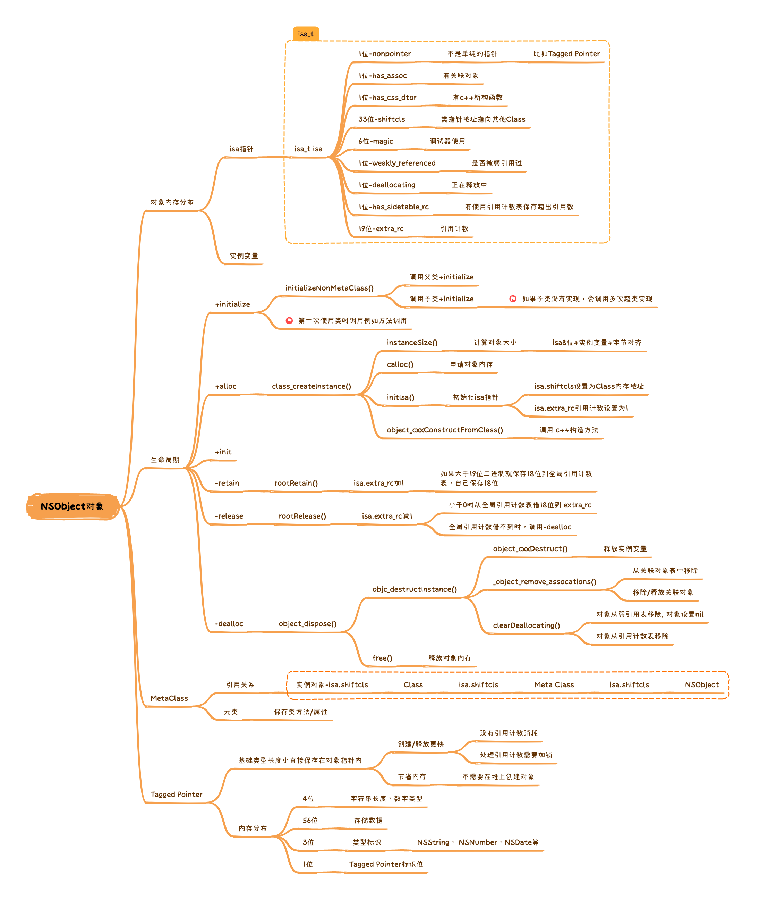
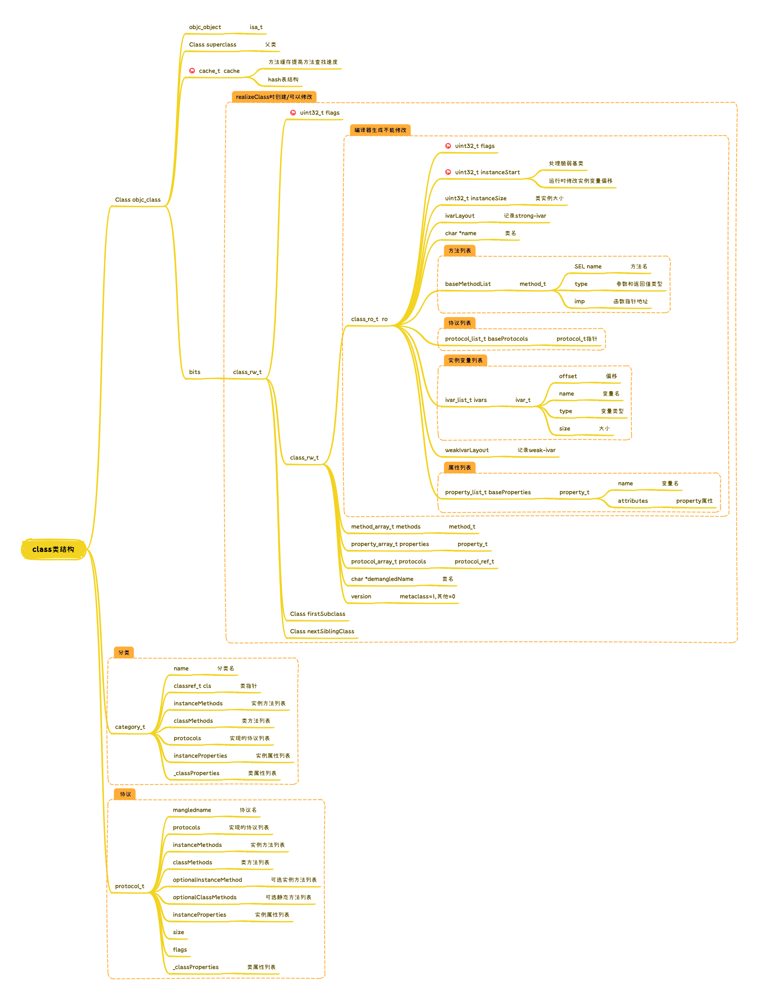
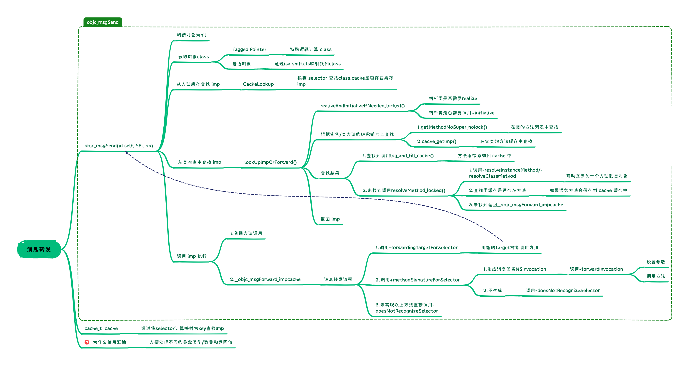
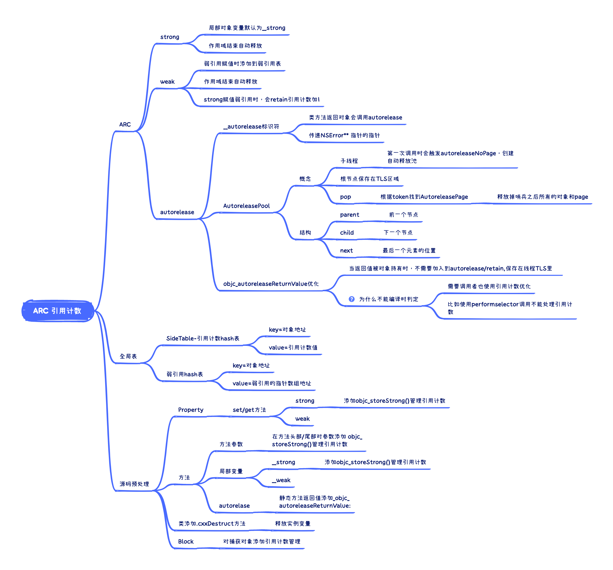
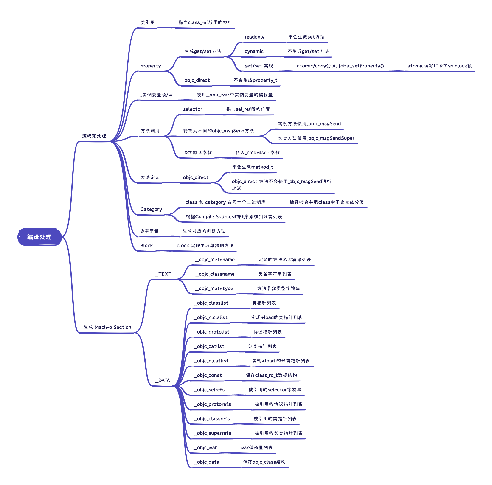
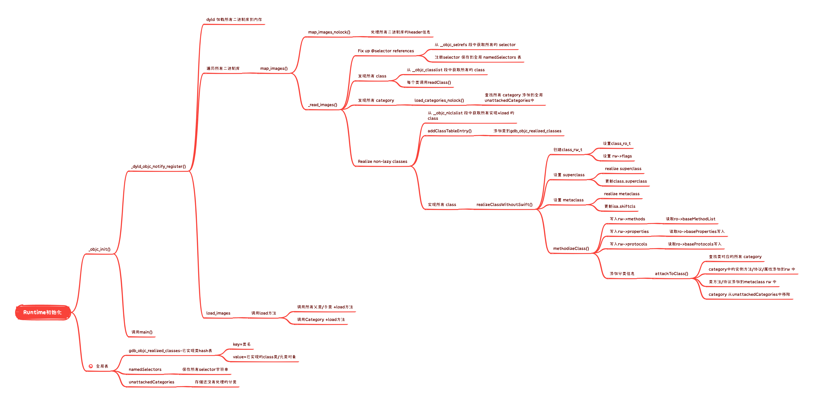
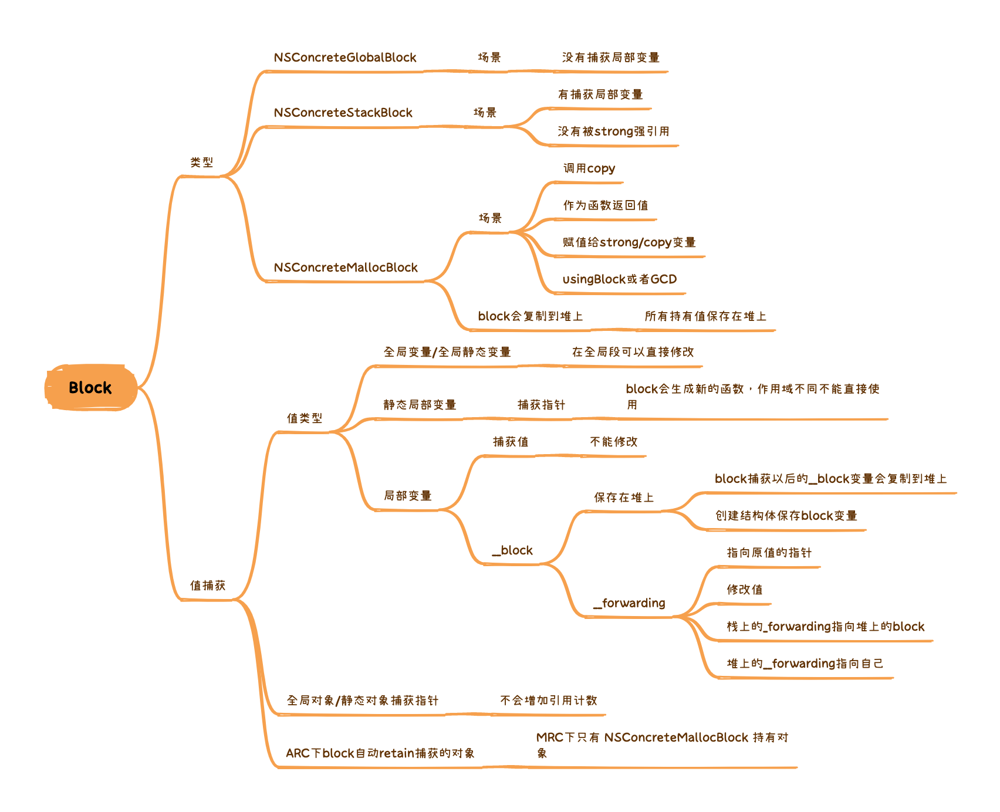
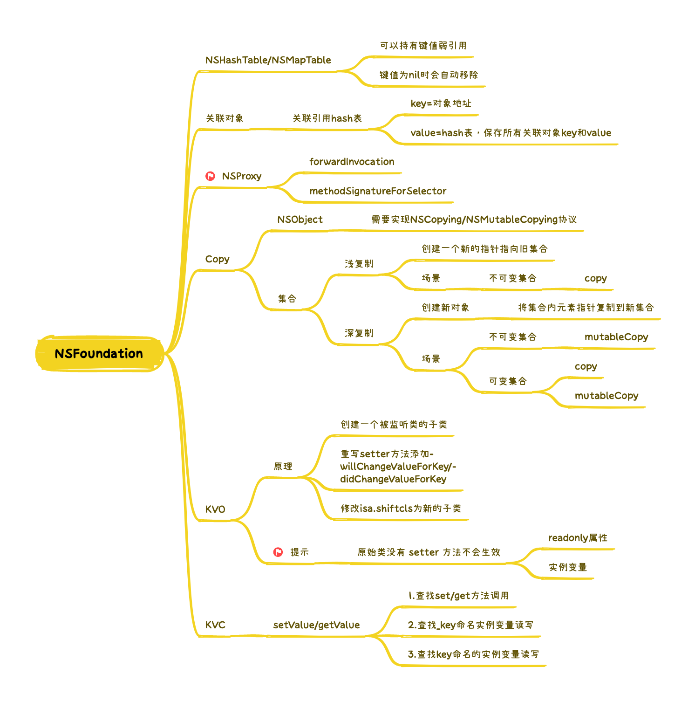
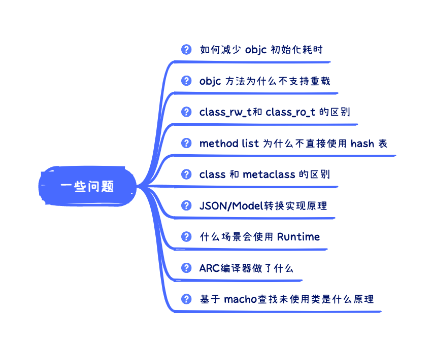

# 介绍

# 内容
## NSObject

## class类结构

## 消息转发

## 引用计数

## 编译处理

## Runtime初始化

## Block

## NSFoundation

## iOS14 优化

# 一些问题

# 扩展链接
- [Programming with Objective-C](https://developer.apple.com/library/archive/documentation/Cocoa/Conceptual/ProgrammingWithObjectiveC/Introduction/Introduction.html)
- [Objective-C Runtime API文档](https://developer.apple.com/documentation/objectivec/objective-c_runtime?language=objc)
- [Objective-C Runtime 源码](https://github.com/0xxd0/objc4)
- [【WWDC20】10163 - iOS 14 苹果对 Objective-C Runtime 的优化](https://juejin.cn/post/6854573210999586829)
- [Objective-C Automatic Reference Counting (ARC)](https://clang.llvm.org/docs/AutomaticReferenceCounting.html)
